# RegionHop VPN

A simple WireGuard VPN setup with multi-region support. Deploys to any AWS region with CDK.

## 🎯 Quick Start with `hop.sh`

Copy `config-template.json` to `config.json` and edit it to your liking.

You can choose to leave the domain blank to use direct IP address based connectivity. If you do provide a domain, RegionHop will create A records under the `regionhop` subdomain there for each region you deploy. A deployment in `eu-central-1` will create a record `eu-central-1.regionhop.example.com`.

Use the **`hop.sh`** script to manage your RegionHop VPN:

```bash
./hop.sh deploy                    # Deploy VPN to default region
```

After deployment, add a client: 
```bash
./hop.sh add-client <your region> <client-name>
```

The command will output a QR code with which you can add the client to the WireGuard app on your phone. To use the client configuration on a computer, download it: 

```bash
./hop.sh download-client <your region> <client-name>
```

Import the downloaded configuration to your WireGuard app.

## 📋 Prerequisites

- Active AWS account with permissions to create VPC, EC2, and IAM resources
- AWS CLI configured with appropriate credentials
- Node.js (v22 or later)

## 🚀 Features

- **Modern VPN Protocol**: WireGuard for high performance and security
- **Multi-Region Support**: Deploy to any AWS region
- **Automated Setup**: One-command deployment with `hop.sh` management script
- **Client Management**: Easy client configuration generation
- **Region Management**: Deploy, manage, and destroy regions independently

## 🏗️ Architecture

```mermaid
flowchart TD
    subgraph "CDK Stack Architecture"
        direction TB
        subgraph PersistenceStack[📦 Persistence Stack]
            S3Bucket[🗂️ Encrypted S3 Bucket<br/>WireGuard State Backup]
        end
        
        subgraph InfrastructureStack[🏗️ Infrastructure Stack]
            VPCRes[☁️ VPC & Subnets]
            SecurityGroups[🛡️ Security Groups]
            IAMRoles[👤 IAM Roles]
            SSHKeys[🔑 SSH Key Pairs]
        end
        
        subgraph ComputeStack[⚡ Compute Stack]
            EC2Instances[💻 EC2 Instance]
            ASG[📈 Auto Scaling Group]
            Lambda[⚡ Lambda Functions<br/>DNS Updater]
        end
        
        InfrastructureStack --> PersistenceStack 
        ComputeStack --> InfrastructureStack
        ComputeStack --> PersistenceStack
    end
    
```



### Three-Stack Architecture

The deployment consists of three CDK stacks per region:

1. **Persistence Stack**: Encrypted S3 bucket for WireGuard state backup
2. **Infrastructure Stack**: VPC, security groups, IAM roles, and SSH key pairs
3. **Compute Stack**: EC2 instances, Auto Scaling Groups, and Lambda functions

## 🛠️ Deployment

### Deploy with Hop

Use the **`hop`** script to manage your RegionHop deployments:

```bash
# Deploy to default region (eu-central-1)
./hop.sh deploy

# Deploy to specific region
./hop.sh deploy us-east-1

# Deploy to multiple regions
./hop.sh deploy --regions us-east-1,eu-central-1,ap-southeast-1

# List available regions
./hop.sh regions

# Check deployment status
./hop.sh status
```

### Alternative: Deploy with AWS CDK

```bash
# Bootstrap CDK for target region (first-time only)
cdk bootstrap --region eu-central-1

# Set region environment variable
export REGIONHOP_REGION=eu-central-1

# Optional: Set deployment ID for unique resource naming (prevents conflicts)
export REGIONHOP_DEPLOYMENT_ID=mydeployment

# Deploy the stacks
npx cdk deploy --all
```

### Configuration Options

#### Deployment ID (Important for Multiple Deployments)
The system includes a configurable `deploymentId` to ensure unique S3 bucket names and prevent conflicts when multiple instances of this app are deployed in the same regions:

**Configuration Methods:**
1. **Environment Variable**: `export REGIONHOP_DEPLOYMENT_ID=myuniqueid`
2. **Config File**: Edit `deploymentId` in `config.json` (default: `"default"`)

**Why This Matters:**
- S3 bucket names must be globally unique across all AWS accounts
- Without unique deployment IDs, multiple deployments would conflict
- Each deployment gets its own isolated S3 bucket: `regionhop-state-backup-{region}-{deploymentId}`

**Example Usage:**
```bash
export REGIONHOP_DEPLOYMENT_ID=myuniqueid
./hop.sh deploy us-east-1
```

## 📱 Client Setup

### 1. Download WireGuard App

Download the official WireGuard app and use the client configuration files to import the configuration.

### 2. Manage VPN Clients

First, add a VPN client to a region:
```bash
# Add a new client (e.g., for your iPhone)
./hop.sh add-client us-east-1 iphone

# Add another client (e.g., for your laptop)
./hop.sh add-client us-east-1 laptop
```

List available clients in a region:
```bash
./hop.sh list-clients us-east-1
```

Remove a client when no longer needed:
```bash
# Remove a specific client (will prompt for confirmation)
./hop.sh remove-client us-east-1 old-phone

# This will:
# • Remove client configuration files from server
# • Remove client keys and certificates
# • Remove peer configuration from WireGuard
# • Update S3 backup to reflect changes
# • Clean up local config files
```

### 3. Download Client Configurations

Download specific client configuration:
```bash
# Download configuration for a specific client
./hop.sh download-client us-east-1 iphone

# Download all client configurations from a region
./hop.sh download-client us-east-1 --all
```

This will create configuration files like `iphone-us-east-1.conf` that you can directly import into the WireGuard app.

### 4. Manual Configuration (Advanced)

SSH into your server in a specific region:
```bash
./hop.sh ssh eu-central-1
```

Retrieve a specific client configuration:
```bash
sudo cat /etc/wireguard/clients/CLIENT_NAME/CLIENT_NAME.conf
```

### 5. Import Configuration

1. Open WireGuard app
2. Click "Import tunnel(s) from file"
3. Select the `CLIENT_NAME-<region>.conf` file
4. Import the file
5. Repeat for each region you want to use

### 6. Connect

Click the toggle switch in WireGuard app to connect to your chosen region.

## 🔧 Management Commands

Use the **hop** tool for all VPN management tasks:

```bash
# Infrastructure Management
./hop.sh deploy                    # Deploy to default region
./hop.sh deploy us-east-1          # Deploy to specific region
./hop.sh destroy us-west-2         # Destroy region deployment
./hop.sh bootstrap ap-northeast-1  # Bootstrap CDK for region

# Status & Information
./hop.sh list                      # List all regions with status
./hop.sh deployed                  # Show only deployed regions
./hop.sh regions                   # Show available regions
./hop.sh status                    # Show deployment status (all regions)
./hop.sh status us-east-1          # Show status for specific region
./hop.sh health                    # Health check all deployed regions

# Connection & Access
./hop.sh ssh us-east-1             # SSH to VPN server in region
./hop.sh config eu-central-1       # Download client configuration (deprecated)
./hop.sh add-client us-east-1 iphone # Add new VPN client to region
./hop.sh remove-client us-east-1 oldphone # Remove VPN client from region
./hop.sh list-clients us-east-1    # List all VPN clients in region
./hop.sh download-client us-east-1 iphone  # Download specific client config
./hop.sh download-client us-east-1 --all   # Download all client configs
```

### Server Management Commands
Once connected via SSH:

```bash
# Check VPN Status
sudo /etc/wireguard/vpn-status.sh

# Add New Client
sudo /etc/wireguard/add-client.sh client-name

# Remove Client
sudo /etc/wireguard/remove-client.sh client-name

# View Connected Clients
sudo wg show

# Check Server Logs
sudo journalctl -u wg-quick@wg0 -f

# Check fail2ban Status
sudo fail2ban-client status
sudo fail2ban-client status sshd
```

## 🔐 Security Features

### Firewall (UFW)
- Only allows SSH (port 22) and WireGuard (port 51820)
- Blocks all other incoming traffic
- Allows all outgoing traffic

### fail2ban
- Protects SSH from brute force attacks
- Bans IPs after 3 failed attempts for 1 hour
- Monitors /var/log/auth.log

### Key Management
- Server keys generated automatically
- Client keys unique per client

## 💸 Runtime cost

The VPN should be rather cheap with t4g.nano spot EC2 instances. Something like ~$1 per month. Data transfer costs depend on usage.

## 🔧 Troubleshooting

Check status and try to restart:
```bash
# Check status
./hop.sh status <your region>
# Restart the EC2 instance
./hop.sh stop <your region>
./hop.sh start <your region> # Might need to wait a few seconds after stopping before running start

Log locations on the EC2 instance. Use `./hop.sh ssh <your region>` to get to the instance.
- **WireGuard**: `sudo journalctl -u wg-quick@wg0`
- **fail2ban**: `sudo tail -f /var/log/fail2ban.log`
- **UFW**: `sudo tail -f /var/log/ufw.log`
- **System**: `sudo tail -f /var/log/syslog`
- **Cloud Init**: `sudo tail -f /var/log/cloud-init-output.log`

## 🔄 Backup and Recovery

### S3 State Backup (Automated)

Each region includes an S3 bucket for secure state backup. The EC2 instances have permissions to sync WireGuard configurations:

```bash
# Backup WireGuard configuration to S3 (automated via cron)
aws s3 sync /etc/wireguard s3://regionhop-state-backup-REGION/wireguard-config/ --exclude "*.tmp" --delete --region REGION

# Restore WireGuard configuration from S3
aws s3 sync s3://regionhop-state-backup-REGION/wireguard-config/ /etc/wireguard --delete --region REGION
```

### Manual Backup (Local)
```bash
# Create local backup directory
sudo mkdir -p /backup/wireguard

# Backup WireGuard configuration locally
sudo cp -r /etc/wireguard /backup/wireguard/
sudo cp /etc/fail2ban/jail.local /backup/wireguard/
sudo cp /etc/ufw/user.rules /backup/wireguard/

# Create tar archive
sudo tar -czf /backup/wireguard-backup-$(date +%Y%m%d).tar.gz /backup/wireguard/
```

### Restore Configuration
```bash
# From S3 (recommended)
aws s3 sync s3://regionhop-state-backup-REGION/wireguard-config/ /etc/wireguard --delete --region REGION

# From local backup
sudo tar -xzf wireguard-backup-YYYYMMDD.tar.gz -C /

# Restart services after restore
sudo systemctl restart wg-quick@wg0
sudo systemctl restart fail2ban
sudo ufw reload
```

## 📚 Additional Resources

- [WireGuard Documentation](https://www.wireguard.com/)
- [AWS CDK Documentation](https://docs.aws.amazon.com/cdk/)

## 🤝 Contributing

Feel free to submit issues and pull requests to improve RegionHop.

## 📄 License

This project is licensed under the MIT License - see the LICENSE file for details.
